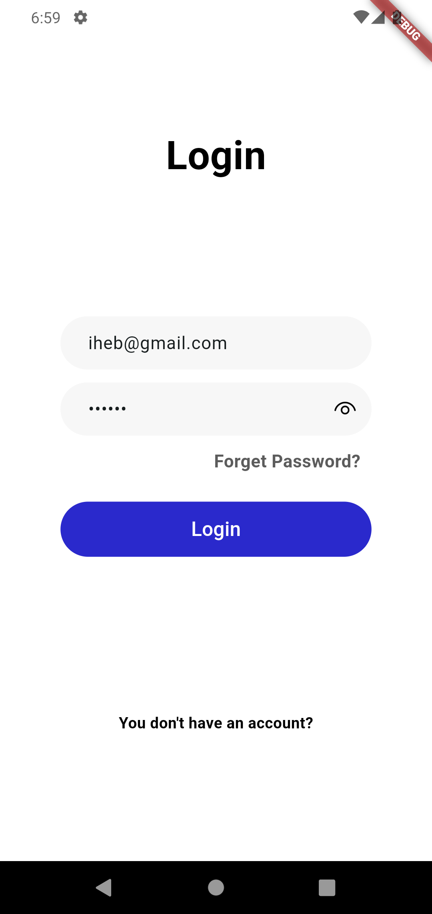
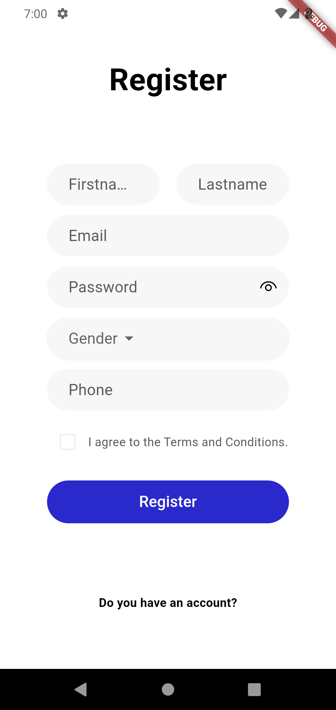
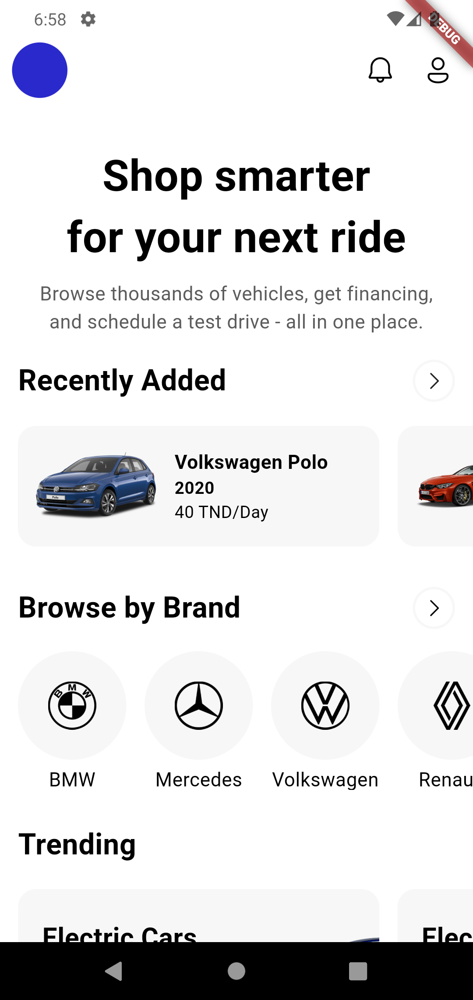
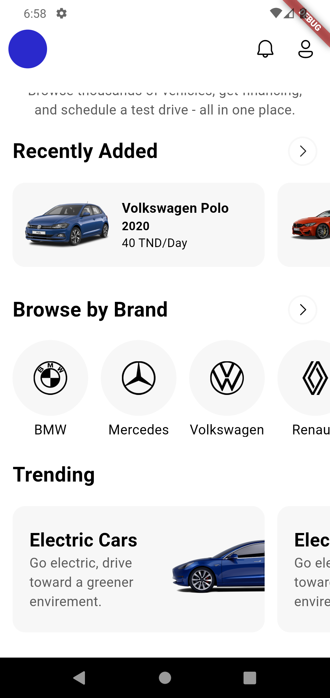
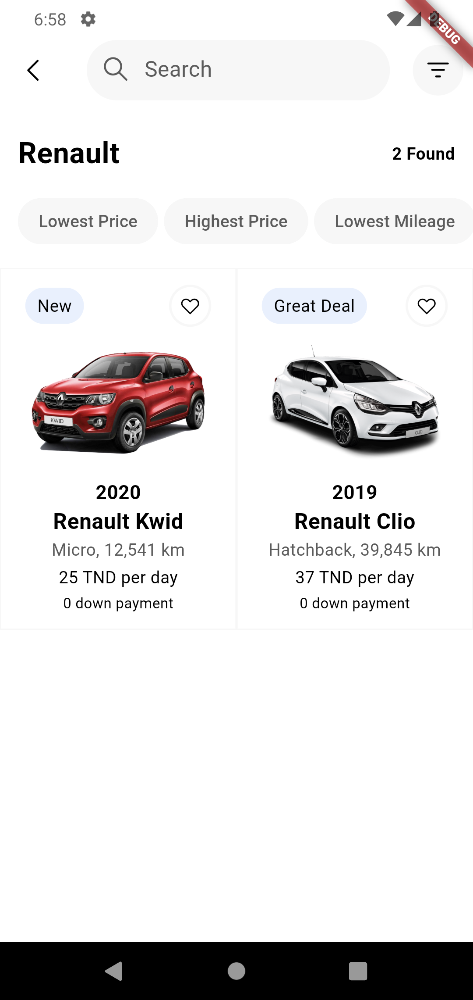
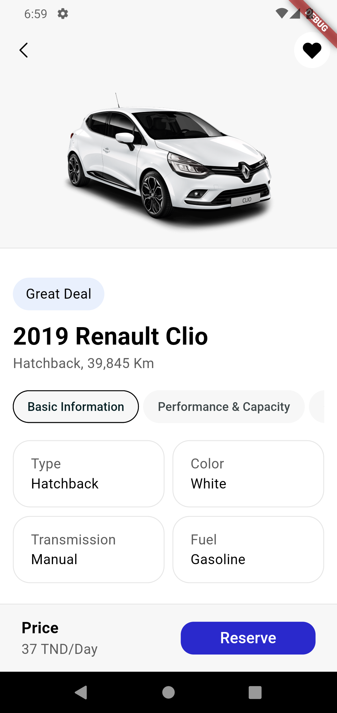

# CarGo

CarGo is a user-friendly mobile app designed to provide quick and convenient car rentals anytime,
anywhere. With a wide selection of vehicles and competitive prices, CarGo ensures you get the
perfect ride for any trip or occasion.

## Features

- **Easy Booking**: Simple and intuitive booking process.
- **Wide Selection**: Variety of vehicles to choose from.
- **Competitive Prices**: Affordable rates for all types of rentals.
- **Flexible Options**: Rent by the hour, day, or week.
- **24/7 Support**: Customer support available around the clock.

## Screenshots

Here are some screenshots of the GeoQuest app in action:

### Login Page

<div style="display: flex; justify-content: space-around;">
    
</div>
*Login Page for user authentication.*

### Signup Page

<div style="display: flex; justify-content: space-around;">
    
</div>
*Signup Page for new user registration.*

### Home Page

<div style="display: flex; justify-content: space-around;">
    
    
</div>
*Home Page showing recently added cars, Brands and Trend topics.*

### Category Page

<div style="display: flex; justify-content: space-around;">
    
</div>
*Category Page for displaying cars for chosen brand.*

### Car Page

<div style="display: flex; justify-content: space-around;">
    
</div>
*Car Page for showing selected car details.*

## Tech Stack

- **Frontend Framework**: Flutter
- **State Management**: GetX
- **Database Platform**: Firebase

## Installation

### Prerequisites

- Flutter installed on your machine. Follow
  the [Flutter installation guide](https://flutter.dev/docs/get-started/install) if not already
  installed.

### Steps

1. Clone the repository:

   ```bash
   git clone https://github.com/Ihebowski/CarGo.git
   ```

2. Navigate to the directory:

   ```bash
   cd CarGo
   ```

3. Install the dependencies:

   ```bash
   flutter pub get
   ```

4. Run the app:

   ```bash
   flutter run
   ```

   Ensure that you have a device or emulator running.

## Project Structure

```
lib/
 ├── models/         # Contains data models representing the application's data structure
 ├── views/          # UI screens for the app's interface, including layouts and widgets
 ├── services/       # Handles API calls and business logic for data management
 ├── controllers/    # GetX controllers managing state and application logic
 └── main.dart       # Main entry point of the app
```

## Contributions

Feel free to fork the repository, open an issue, or submit a pull request for any improvements or
bug fixes.

## License

This project is licensed under the MIT License. See the [LICENSE](LICENSE) file for more
information.

## Contact

For any questions or support, please contact us at Iheb.Barrah@gmail.com.
